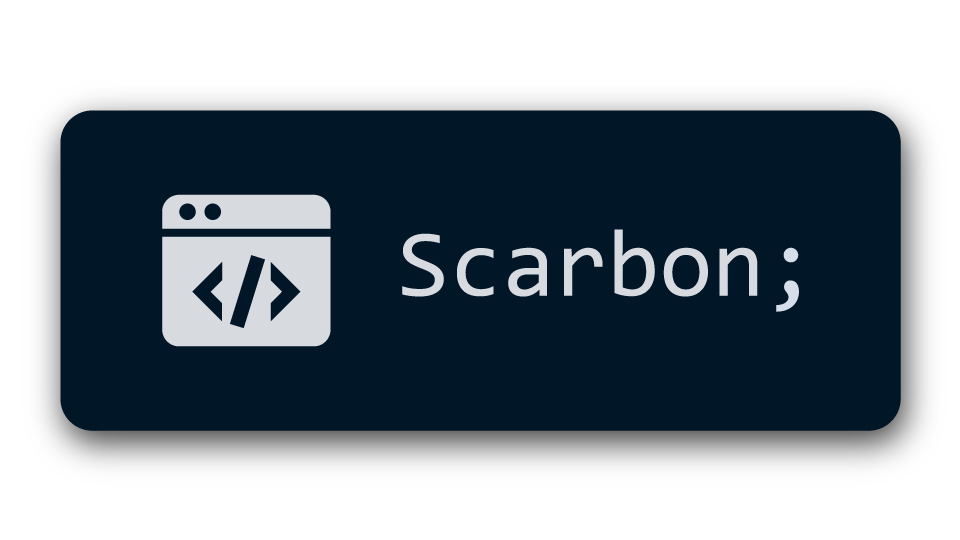
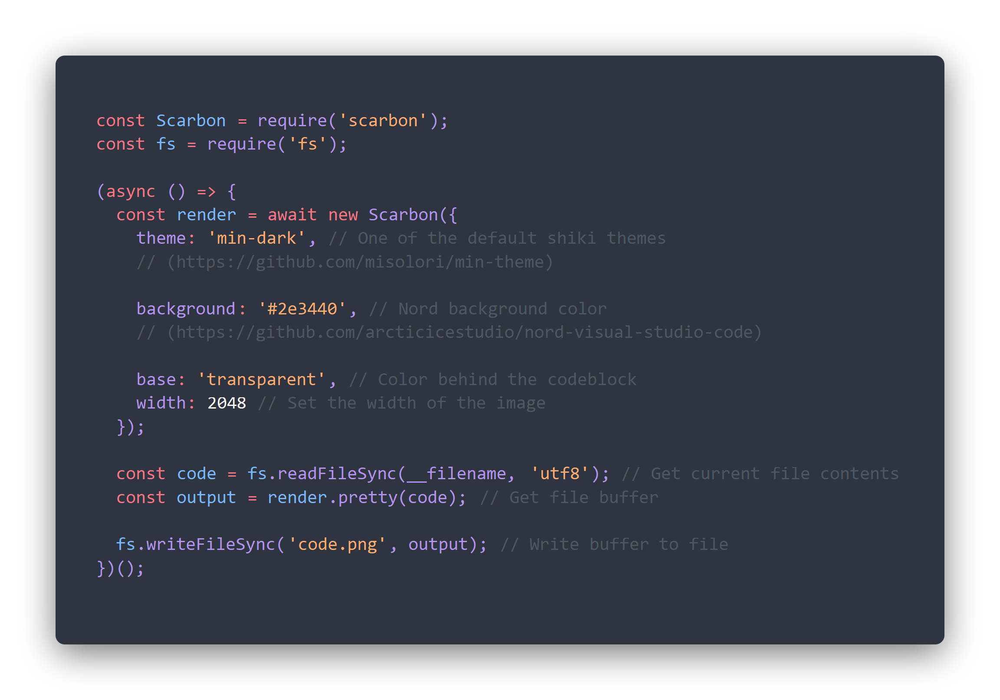

> Scarbon (Scuffed Carbon) is an elegant code renderer based off [Carbon](https://carbon.now.sh/) built 100% locally. Scarbon made using [Shiki](https://shiki.matsu.io/) for highlighting, [Prettier](https://prettier.io/) for formatting, and [Canvas](https://www.npmjs.com/package/canvas) for rendering.



# Example
The below snippet creates a render of itself
```js
const Scarbon = require("scarbon");
const fs = require("fs");

(async () => {
  const render = await new Scarbon({
    theme: "min-dark", // One of the default shiki themes
    // (https://github.com/misolori/min-theme)

    background: "#2e3440", // Nord background color
    // (https://github.com/arcticicestudio/nord-visual-studio-code)

    base: "transparent", // Color behind the codeblock
    width: 2048, // Set the width of the image
    radius: 32 // Set the radius of the codeblock corner
  });

  const code = fs.readFileSync(__filename, "utf8"); // Get current file contents
  const output = render.pretty(code); // Get file buffer

  fs.writeFileSync("code.png", output); // Write buffer to file
})();
```
Output image (`code.png`)

# Documentation
**Methods**
```js
const Scarbon= require("scarbon")

Scarbon.load(theme) // { Promise } => Theme to use in options
new Scarbon(options) // { Promise } => Renderer (below)
```

**Renderer** (`class`)
```js
{
	png(code, options)
	svg(code, options)
	pretty(code, options)
}
```

**Theme** (`string`)
The theme to use, can be a URL to a theme JSON, a path to a theme JSON file, theme object,  theme buffer

**Code** (`string`)
The text to format (Should match the language, and formatter parser if provided)

**Options** (`object`)
Option|Description|Type|Default|Availability
:---|:----:|:----:|:----:|---:
formatter|Options for Prettier|formatOptions|formatOptions|all
background|Background color for the codeblock|color string|Loaded theme background, or black|all
padding|Amount of padding to add (8 => 1/8 of width)|number|8|pretty
width|Width of output image in pixels|number|1920|pretty, png
radius|Radius of the codeblock background corners|number|16|all
size|Size of the code font|number|24|all
font|Font to use for the code (A bit dodgy)|string|Consolas|all
base|Color behind code block|color string| #ABB8C3|pretty
lang|Language to highlight|language string|javascript|all
theme|Theme to use (Use `Scarbon.load` for external themes)|theme string, loaded theme|nord|all

formatOptions (`object`)
Option|Description|Type|Default
:---|:----:|:----:|---:
format|Engine for language formatting|string|babel
trailingComma|Whether to add a comma to the end of objects|string (all, none, es5)|none
tab|Indent size|number|2
length|Max length before wrapping text|number|80
bracketSpacing|Whether to add space in between {}|boolean|true
semicolon|Whether to add semicolons to the end of lines|boolean|true
singleQuote|Whether to use ' on strings instead of "|boolean|true
disabled|Whether to disable the formatter all together|boolean|false
