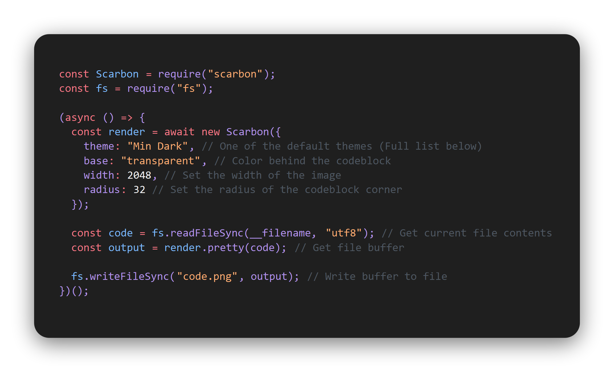

> Scarbon (Scuffed Carbon) is an elegant code renderer based off [Carbon](https://carbon.now.sh/) built 100% locally. Scarbon made using [Shiki](https://shiki.matsu.io/) for highlighting, [Prettier](https://prettier.io/) for formatting, and [Canvas](https://www.npmjs.com/package/canvas) for rendering.


# Example
The below snippet creates a render of itself
```js
const Scarbon = require("scarbon");
const fs = require("fs");

(async () => {
  const render = await new Scarbon({
    theme: "Min Dark", // One of the default themes (Full list below)
    base: "transparent", // Color behind the codeblock
    width: 2048, // Set the width of the image
    radius: 32 // Set the radius of the codeblock corner
  });

  const code = fs.readFileSync(__filename, "utf8"); // Get current file contents
  const output = render.pretty(code); // Get file buffer

  fs.writeFileSync("code.png", output); // Write buffer to file
})();
```
Output image (`code.png`)


# Documentation
**Methods**
```js
const Scarbon= require("scarbon")

Scarbon.list() // List of registered themes to load by name
Scarbon.register(theme) // Register a theme to load by name
new Scarbon(options) // { Promise } => Renderer (below)
```

**Renderer** (`class`)
```js
{
	png(code, options)
	svg(code, options)
	pretty(code, options)
}
```

**Theme** (`string`, `object`)
The theme to use, can be a registered theme name, a URL to a VSCode theme JSON, a path to a VSCode theme JSON file, VScode theme object

**Code** (`string`)
The text to format (Should match the language, and formatter parser if provided)

**Options** (`object`)
Option|Description|Type|Default|Availability
:---|:----:|:----:|:----:|---:
formatter|Options for Prettier|formatOptions|formatOptions|all
background|Background color for the codeblock|color string|theme background|all
padding|Amount of padding to add (8 => 1/8 of width)|number|8|pretty
width|Width of output image in pixels|number|1200|pretty, png
radius|Radius of the codeblock background corners|number|16|all
size|Size of the code font|number|24|all
font|Font to use for the code (Experimental)|string|Consolas|all
base|Color behind code block|color string| #ABB8C3|pretty
lang|Language to highlight in|language string|javascript|all
theme|Theme to use|theme|nord|constructor

formatOptions (`object`)
Option|Description|Type|Default
:---|:----:|:----:|---:
format|Engine for language formatting|string|babel
trailingComma|Whether to add a comma to the end of objects|string (all, none, es5)|none
tab|Indent size|number|2
length|Max length before wrapping text|number|80
bracketSpacing|Whether to add space in between {}|boolean|true
semicolon|Whether to add semicolons to the end of lines|boolean|true
singleQuote|Whether to use ' on strings instead of "|boolean|false
disabled|Whether to disable the formatter all together|boolean|false

# Default Theme List
- 3024 Night
- A11y Dark
- Base 16 Dark
- Base 16 Light
- Blackboard
- Cobalt
- Dracula
- DuoTone Earth
- DuoTone Forest
- DuoTone Sea
- DuoTone Sky
- DuoTone Space
- Github Dark
- Github Light
- Hopscoth
- light-plus
- Lucario
- Material Darker
- Material Default
- Material Lighter
- Material Ocean
- Material Palenight
- Min Dark
- Min Light
- Monokai
- Night Owl Italics
- Night Owl
- Nord
- Oceanic Next
- One Dark
- One Light
- Panda
- Paraiso Dark
- Paraiso Light
- Seti
- Shades of Purple Italics
- Shades of Purple
- Slack Dark
- Slack Ochin
- Solarized Dark
- Solarized Light
- Synthwave 84
- Twilight
- Verminal
- VS Code
- Zenburn
